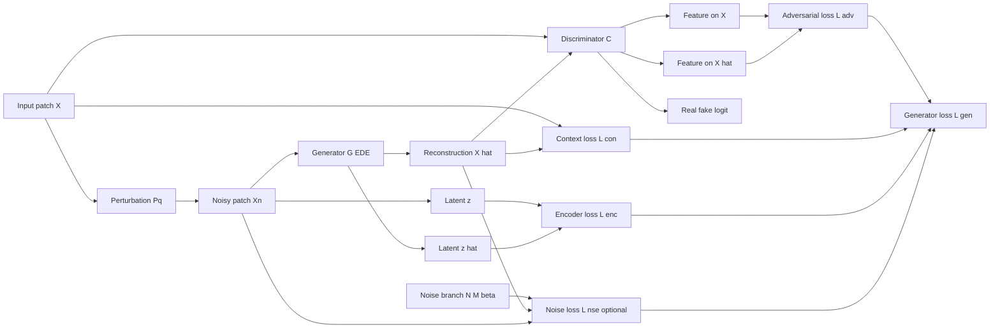
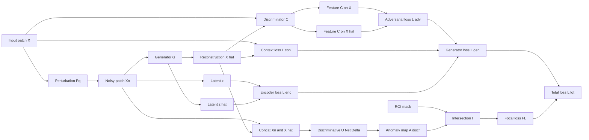

# Simple-GRD-Net

Official configurable implementation of:

- **GRD-Net (2023)**: Generative-Reconstructive-Discriminative anomaly detection with ROI-aware attention.
- **DeepIndustrial-SN (2026)**: runtime-optimized configuration focused on the generative branch for fast patch-level decisions.

This repository now provides one **YAML-configurable pipeline** with two paper profiles, a full **PyTorch backend**, and a **TensorFlow/Keras scaffold API** for future parity.

## 1. Paper Mapping

Source documents in this repository:

- `docs/International_Journal_of_Intelligent_Systems_-_2023_-_Ferrari_-_GRD‐Net.pdf`
- `docs/DeepIndustrial_SN.pdf`

### 1.1 GRD-Net 2023 profile (`grdnet_2023_full`)

Core design:

1. Generator `G` with encoder-decoder-encoder topology.
2. Discriminator `C` for adversarial feature matching.
3. Discriminative U-Net `Δ` for anomaly map prediction.
4. ROI attention through intersection in discriminative loss.

Paper-level equations implemented as profile defaults:

Synthetic perturbation:

$$
(X_n, M) = P_q(X)
$$

Adversarial feature loss:

$$
L_{adv} = L_2\big(F_C(X), F_C(\hat{X})\big)
$$

Discriminator objective (AMP-safe logits form used in code):

$$
L_{disc} = \frac{1}{2}\left(
\mathrm{BCEWithLogits}(D(X), 1) +
\mathrm{BCEWithLogits}(D(\hat{X}), 0)
\right)
$$

Contextual loss:

$$
L_{con} = w_a L_1(X, \hat{X}) + w_b L_{SSIM}(X, \hat{X})
$$

Encoder consistency:

$$
L_{enc} = L_1(z, \hat{z})
$$

Generator objective:

$$
L_{gen} = w_1 L_{adv} + w_2 L_{con} + w_3 L_{enc}
$$

ROI intersection for discriminative supervision:

$$
I = A_{discr} \odot ROI_{input}
$$

Total full-profile objective:

$$
L_{tot} = L_{gen} + FL(I, M)
$$

where `FL` is focal loss.

Default implementation policy for this profile:

- contextual base term uses `L1`
- noise regularization term `L_{nse}` is disabled
- discriminator branch uses `BCEWithLogitsLoss` (equivalent to sigmoid + BCE, but AMP-safe)

### 1.2 DeepIndustrial-SN 2026 profile (`deepindustrial_sn_2026`)

This profile keeps the generative adversarial core, with deployment-oriented constraints and score computation.

Perturbation mechanism:

$$
X^* = (1 - M)\odot X + (1-\beta)M\odot X + \beta N, \quad \beta\sim U(0.5, 1.0)
$$

Noise regularization term:

$$
L_{nse} = w_4 \cdot L_2\left(\left|(1-\beta)\hat{M}\odot\hat{X} - M\odot X\right|,\, \beta N\right)
$$

Contextual update (Huber + SSIM):

$$
L_{con} = w_a L_{Huber}(X, \hat{X}) + w_b L_{SSIM}(X, \hat{X})
$$

Anomaly score:

$$
\phi = 1 - SSIM(X, \hat{X})
$$

Heatmap:

$$
H = \lvert X - \hat{X} \rvert
$$

with per-sample min-max normalization.

Default implementation policy for this profile:

- contextual base term uses `Huber`
- noise regularization term `L_{nse}` is enabled
- discriminator branch uses `BCEWithLogitsLoss` on logits

## 2. Architecture

Top-level package (`grdnet/`) is layered and modular:

- `grdnet/config`: strict typed schema + YAML loader.
- `grdnet/core`: deterministic logging, reproducibility, exceptions.
- `grdnet/data`: MVTec-like adapter, custom MVTec-like extension point, patch extraction.
- `grdnet/models/pytorch`: residual generator/discriminator and U-Net segmentator.
- `grdnet/models/tensorflow`: scaffold placeholders for API parity planning.
- `grdnet/losses`: centralized objective definitions.
- `grdnet/backends`: strategy/factory backend abstraction.
- `grdnet/training`: loop + checkpoints.
- `grdnet/inference`: calibrate/eval/infer workflows.
- `grdnet/metrics`: thresholding and score metrics.
- `grdnet/reporting`: structured console + CSV outputs.
- `grdnet/pipeline`: command runners.

### 2.1 DeepIndustrial-SN Training Graph



### 2.2 GRD-Net Full Graph (with second U-Net)



## 3. Dataset Contract

Current official adapter supports:

```text
mvtec/
  bottle/
    train/
      good/
        *.png
    test/
      good/
        *.png
      defect_type/
        *.png
    ground_truth/
      defect_type/
        *_mask.png
  capsule/
    ...
```

Configured split roots remain explicit in YAML (`data.train_dir`, `data.test_dir`, `data.mask_dir`, ...). The
official profile defaults now target the benchmark root symlink directly:

```text
train_dir: ./mvtec
test_dir: ./mvtec
calibration_dir: ./mvtec
mask_dir: null
```

When a split root points to MVTec benchmark root (`mvtec/<category>/...` layout), commands now run
per-category automatically: one model/checkpoint/report set per category.

Per-category configuration is also supported:

```text
train_dir: mvtec/<category>/train
test_dir: mvtec/<category>/test
mask_dir: mvtec/<category>/ground_truth
```

Notes:

- Training can be `nominal_train_only=true`.
- Official profile defaults use automatic device selection (`backend.device: "auto"`).
- `roi_root` missing defaults ROI to all ones.
- Missing ROI mask falls back to full-image ROI (all ones) with warning logs.
- Missing ground-truth mask falls back to all-zero mask and image is treated as good (label 0), with warning logs.
- `patch_size` and `patch_stride` accept either scalar values or explicit pairs `[h, w]`.
- `inference.run_acceptance_ratio=0.0` disables image-level acceptance voting and keeps patch-level thresholding only.

## 4. Config Profiles

Provided configs:

- `configs/profiles/grdnet_2023_full.yaml`
- `configs/profiles/deepindustrial_sn_2026.yaml`

DeepIndustrial-SN profile defaults keep the paper-aligned architecture
(`base_features: 128`, `stages: [3,3,3,3]`) while using a conservative
`data.batch_size: 4` default for commodity 5-6 GB GPUs and enabling
`backend.mixed_precision: true` on CUDA. For paper-scale runs on larger GPUs,
set `data.batch_size: 32`.

Stage-resampling policy is now explicit and configurable:

- `model.encoder_downsample_position`: `"last"` (paper-canonical) or `"first"` (ablation).
- `model.decoder_upsample_position`: `"last"` (paper-canonical) or `"first"` (ablation).

Backend stubs:

- `configs/backends/pytorch.yaml`
- `configs/backends/tensorflow_scaffold.yaml`

## 5. Installation

Runtime minimums:

- Python `>= 3.11`
- Torch `>= 2.7.0`

```bash
python -m venv .venv
source .venv/bin/activate
pip install -r requirements.txt
pip install -e .
```

## 6. CLI Usage

Validate configuration:

```bash
grdnet validate-config -c configs/profiles/grdnet_2023_full.yaml
```

Train:

```bash
grdnet train -c configs/profiles/grdnet_2023_full.yaml
```

Calibrate threshold:

```bash
grdnet calibrate -c configs/profiles/deepindustrial_sn_2026.yaml --checkpoint artifacts/checkpoints/deepindustrial_sn_2026
```

Evaluate:

```bash
grdnet eval -c configs/profiles/deepindustrial_sn_2026.yaml --checkpoint artifacts/checkpoints/deepindustrial_sn_2026
```

Infer:

```bash
grdnet infer -c configs/profiles/deepindustrial_sn_2026.yaml --checkpoint artifacts/checkpoints/deepindustrial_sn_2026
```

### 6.1 Quick Command Checklist

Run from repository root:

```bash
python main.py validate-config -c configs/profiles/deepindustrial_sn_2026.yaml
python main.py train -c configs/profiles/deepindustrial_sn_2026.yaml
python main.py calibrate -c configs/profiles/deepindustrial_sn_2026.yaml --checkpoint artifacts/checkpoints/deepindustrial_sn_2026
python main.py eval -c configs/profiles/deepindustrial_sn_2026.yaml --checkpoint artifacts/checkpoints/deepindustrial_sn_2026
python main.py infer -c configs/profiles/deepindustrial_sn_2026.yaml --checkpoint artifacts/checkpoints/deepindustrial_sn_2026
```

### 6.2 Single-Category Experiment (One Model)

Use this mode when you want one model for one MVTec class (for example `hazelnut`).

1. Copy the profile YAML and rename it (example):

```bash
cp configs/profiles/deepindustrial_sn_2026.yaml configs/profiles/deepindustrial_sn_2026_hazelnut.yaml
```

2. In `configs/profiles/deepindustrial_sn_2026_hazelnut.yaml`, set category-specific roots and artifacts:

```yaml
data:
  train_dir: "./mvtec/hazelnut"
  val_dir: null
  test_dir: "./mvtec/hazelnut"
  calibration_dir: "./mvtec/hazelnut"
  mask_dir: null

training:
  checkpoint_dir: "./artifacts/checkpoints/deepindustrial_sn_2026/hazelnut"
  output_dir: "./artifacts/reports/deepindustrial_sn_2026/hazelnut"
```

3. Run full pipeline:

```bash
CFG=configs/profiles/deepindustrial_sn_2026_hazelnut.yaml

python main.py validate-config -c "$CFG"
python main.py train -c "$CFG"

CKPT=$(ls -1 artifacts/checkpoints/deepindustrial_sn_2026/hazelnut/epoch_*.pt | sort | tail -n 1)
echo "$CKPT"

python main.py calibrate -c "$CFG" --checkpoint "$CKPT"
python main.py eval -c "$CFG" --checkpoint "$CKPT"
python main.py infer -c "$CFG" --checkpoint "$CKPT"
```

4. Data usage in this mode:

- Training reads `./mvtec/hazelnut/train/good/*` only (`nominal_train_only=true`).
- Calibration reads `./mvtec/hazelnut/test/*` and masks from `./mvtec/hazelnut/ground_truth/*`.
- Evaluation and inference use the same `test` and `ground_truth` roots.

5. Output locations in this mode:

- Checkpoints: `artifacts/checkpoints/deepindustrial_sn_2026/hazelnut/epoch_XXXX.pt`
- Metrics/predictions: `artifacts/reports/deepindustrial_sn_2026/hazelnut/*.csv`

### 6.3 Full MVTec Benchmark Mode (Automatic Category Loop)

Use this mode for benchmark protocol: one independent model per category across the full dataset.

1. Keep benchmark-root paths in YAML:

```yaml
data:
  train_dir: "./mvtec"
  test_dir: "./mvtec"
  calibration_dir: "./mvtec"
  mask_dir: null
```

2. Run commands once; runner auto-discovers categories and loops:

```bash
CFG=configs/profiles/deepindustrial_sn_2026.yaml

python main.py validate-config -c "$CFG"
python main.py train -c "$CFG"
python main.py calibrate -c "$CFG" --checkpoint artifacts/checkpoints/deepindustrial_sn_2026
python main.py eval -c "$CFG" --checkpoint artifacts/checkpoints/deepindustrial_sn_2026
python main.py infer -c "$CFG" --checkpoint artifacts/checkpoints/deepindustrial_sn_2026
```

3. Category discovery rule:

- A folder is treated as one category only if it contains all three subfolders:
  `train/`, `test/`, and `ground_truth/`.
- Example discovered categories: `bottle`, `capsule`, `hazelnut`, `zipper`, etc.

4. Per-category data mapping in benchmark mode:

- Train on `mvtec/<category>/train/good/*` (with default `nominal_train_only=true`).
- Calibrate on `mvtec/<category>/test/*` with masks resolved from `mvtec/<category>/ground_truth/*`.
- Evaluate/infer on the same category `test` split.

5. Checkpoint argument behavior in benchmark mode:

- Directory mode (recommended):
  `--checkpoint artifacts/checkpoints/deepindustrial_sn_2026`
  The runner loads latest `epoch_*.pt` from each category subfolder.
- Template mode (explicit):
  `--checkpoint "artifacts/checkpoints/deepindustrial_sn_2026/{category}/epoch_0010.pt"`

6. Artifact structure in benchmark mode:

```text
artifacts/
  checkpoints/
    deepindustrial_sn_2026/
      bottle/epoch_XXXX.pt
      capsule/epoch_XXXX.pt
      ...
  reports/
    deepindustrial_sn_2026/
      bottle/metrics.csv
      bottle/predictions.csv
      capsule/metrics.csv
      capsule/predictions.csv
      ...
```

7. Expected benchmark log signals:

- `benchmark_mode command=train categories=...`
- `benchmark_category_start command=<train|calibrate|eval|infer> category=<name>`
- `benchmark_category_done ...`

Troubleshooting:

- `backend.device: "auto"` probes CUDA. If CUDA initialization fails, the backend now reports a deterministic error message and falls back to CPU.
- On 5-6 GB GPUs, start with `backend.mixed_precision: true` and `data.batch_size: 4`.
- If training is OOM or cuBLAS init fails, lower `data.batch_size` (for example `4 -> 2 -> 1`) and set `PYTORCH_CUDA_ALLOC_CONF=expandable_segments:True`.

## 7. Output Artifacts

Artifacts are written under `training.output_dir` and `training.checkpoint_dir` from YAML:

- In benchmark-root mode, artifacts are nested by category (for example `.../bottle`, `.../zipper`).

- `metrics.csv`: epoch and evaluation metrics.
- `predictions.csv`: patch-wise scores/predictions plus image-level aggregation fields (`image_prediction`, `anomalous_patch_ratio`).
- `train_batch_previews/epoch_XXXX_step_YYYY.png`: 4-row train preview composite (`X`, `X*`, Perlin mask `M`, `X_hat`) captured from configured train steps.
- `epoch_XXXX.pt`: full training checkpoints.

Train preview controls are configurable from YAML:

```yaml
reporting:
  train_batch_preview:
    enabled: true
    every_n_epochs: 1
    step_index: 1
    max_images: 8
    subdir: "train_batch_previews"
```

Evaluation output metrics include:

- `f1`, `accuracy`, `precision`, `recall`
- `tp`, `tn`, `fp`, `fn`
- `auroc`, `ap` (`average_precision`)
- `balanced_accuracy`, `tpr`, `tnr`

## 8. Backend Status

- `pytorch`: full v1 implementation.
- `tensorflow_scaffold`: API placeholder only. Commands requiring compute raise deterministic `NotImplementedError` with explicit guidance.

## 9. Reproducibility

Determinism controls are first-class config fields:

- `system.seed`
- `system.deterministic`

The implementation seeds Python, NumPy, and PyTorch RNGs and configures deterministic backend behavior when requested.

## 10. Theory References

Primary references implemented in this repo:

1. **Ferrari et al. (2023)**, *GRD-Net: Generative-Reconstructive-Discriminative Anomaly Detection with Region of Interest Attention Module*, International Journal of Intelligent Systems. PDF in `docs/International_Journal_of_Intelligent_Systems_-_2023_-_Ferrari_-_GRD‐Net.pdf`.
2. **Ferrari et al. (2026)**, *DeepIndustrial_SN* (runtime-focused GRD-Net variant). PDF in `docs/DeepIndustrial_SN.pdf`.

Secondary conceptual references used by both papers and reflected in this codebase:

- GANomaly-style E-D-E reconstruction consistency.
- DRÆM-inspired synthetic perturbation via Perlin-mask anomaly simulation.
- SSIM-guided reconstruction quality and heatmap-based anomaly localization.

## 11. Quality Gates (project policy)

The rebuild is structured for strict gates:

- lint (`ruff`)
- type checks (`mypy`)
- tests (`pytest`)
- dependency vulnerability audit (`pip-audit`)
- unsafe-code scan (`bandit`)
- coverage gate (`pytest --cov ... --cov-fail-under=90`)

## 12. Important Current Scope

- Full scientific/engineering implementation is currently **PyTorch-first**.
- TensorFlow/Keras is scaffolded for interface stability and future parity work.
- Public dataset support currently targets MVTec-style structures.
